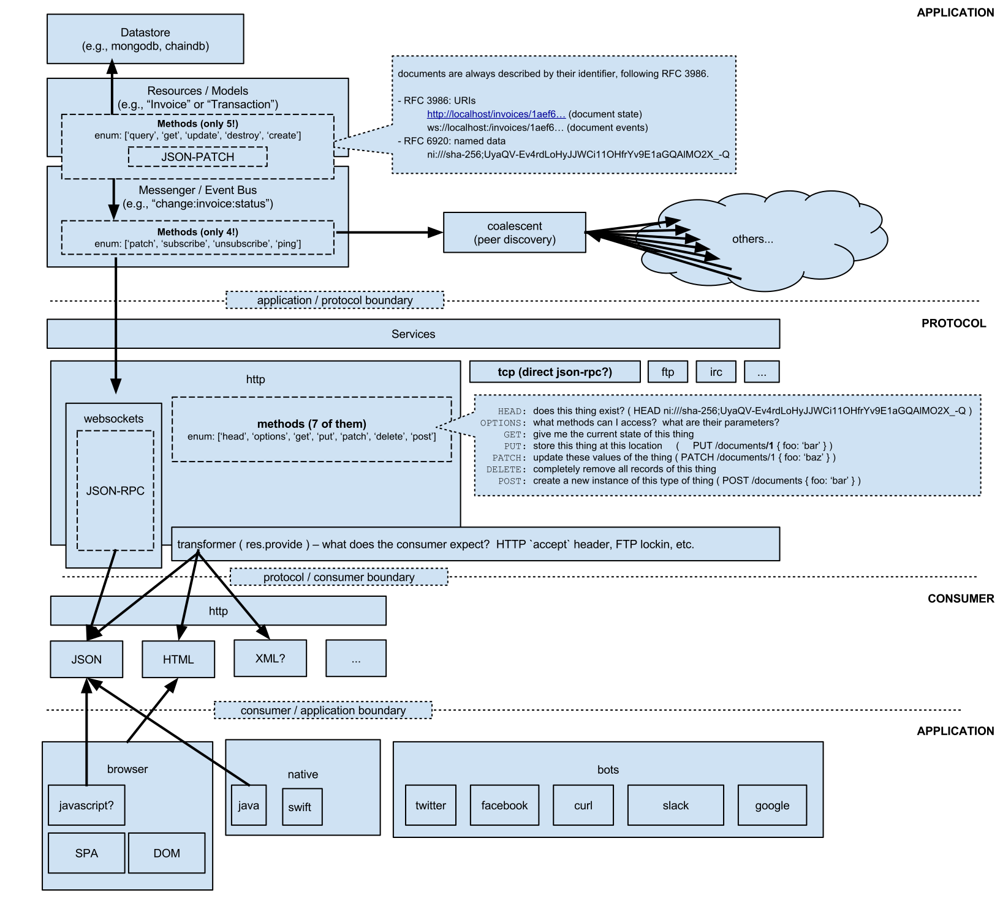

Maki
==============
[](https://travis-ci.org/martindale/maki)
[](https://coveralls.io/r/martindale/maki?branch=master)

Maki is a framework for hand-rolling web applications in a way that makes sense to a human.

- **REST API built-in.**  All URIs are semantic and indempotent, automatically.
- **Client-Responsiveness.**  Don't rely on user-agents or referers, but instead respond to what the client supports.  Make a request that only accepts JSON?  Get JSON back.  Accept HTML?  Get HTML back.
- **Javascript _optional_.**  If the client doesn't have Javascript enabled, applications built with Maki will continue to work using pure HTML.  When Javascript _is_ available, a performant and well-designed client-side application takes over to eliminate full-page loads.  See also [Modules](#modules).

## Quick Start
You'll need [node.js](http://nodejs.org) to build a Maki application.   Additionally, [MongoDB](http://mongodb.org) and [Redis](http://redis.org) are the default storage and messaging engines, so you will need to install and configure them to use the defaults, or override them if you'd like to use something different.

1. Install Maki: `npm install martindale/maki`
2. Create your app, perhaps in `yourapp.js`:
  ```javascript
  var myApp = new require('maki');
  
  myApp.define('Widget', {
    attributes: {
      name: String
    }
  });
  
  myApp.start();
  ```
3. Start your app: `node yourapp.js` – by default, accessible at [http://localhost:9200](http://localhost:9200)

### Configuration

Maki-built apps do not require any special configuration.  However, it is intended to be a platform for customization – it will look in your project's folder for customizations (such as a change to the HTTP port) based on the pattern exposed by [its Default Directory Structure](#default-directory-structure).

For example, add this file to `./config/index.js` to change the HTTP port:
```javascript
module.exports = { services: { http: { port: 8080 } } };
```

...or this file to `./app/views/index.jade` to change what the index page looks like:
```jade
extends layouts/default

block content
  h1 Hello, world!
```

Maki is zero-configuration by default, but will use your changes where available as an extension to its own internal, default behaviors.  See below for further documentation on the options and default behaviors.

## Documentation
Maki exposes an extremely simple interface to a powerful set of features.  These features are easy to understand, as they stem from a basic set of principles and philosophies.  We'll start with some simple definitions.

### Why?
In a traditional application – for example, a web application – a front-end engineer might change the interaction pattern of a particular interface control in such a way that the server interface might no longer be sufficient.  In said traditional application, server-side changes are necessary to support the front-end engineers.  With Maki, **interface elements can be changed freely and be predictably bound to server resources.


### Definitions
In general, we'll be using the proper noun form of these definitions when referring to them explicitly.

- **Application:** the executable process that binds Resources and their associated Models, Controllers, and Views into a deliverable Service.
- **Resource:** the abstract concept of an interactive object.  For example, a "user" of a website is a Resource, and can be interacted with; created (registered), listed (page displaying a list of users), and viewed (profile page).  Resources generally expose one or more identifiers, or Uniform Resource Identifiers (URI).
- **Module:** a collection of **renderables** (html, lexers, etc.) and **their associated styling**.  For example, in an HTML context, a **Module** consists of HTML, Javascript, and associated CSS for styling.
- **Model:** the abstract class that exposes a Resource's Schema and associated validators, methods, and statics.
- **Controller:** the code associated with specific interactions on a Resource and the behavior of the Application.
- **View:** logic and template for displaying a specific Resource.  This generally contains logic and is dependent on context.  A View MAY compose several Modules.
- **Service:** the offering of your app / website / api via various protocols (HTTP, WebSockets, gopher, etc.)

## Resource-Driven Development (RDD)
Generally, programming applications involves writing logic around a series of Resources to control their behavior and deliver an experience with the application's "Scope".  Maki aims to _start_ with that mental model of your application's "Scope", allow you to **hand-roll** (get it?) extensions (read: add business logic) to that mental model, and then deliver that model as a Service.

**Example Maki Application**  
All URIs are automatically derived from the the Resource definition.
```javascript
var config = require('./config');

var Maki = require('maki');
var maki = new Maki( config );

maki.define('Person', {
  attributes: {
    name: { type: String , max: 80 },
    slug: { type: String , max: 80 , id: true }
  }
});

maki.start();
```
That's it.  That's all you need.  A `GET` request to `/people` will now provide a list of people:

```bash
> curl http://localhost:9200/people
[{"slug": "martindale", "name": "martindale"}]
```
Requesting an HTML version of that Resource will give you exactly that:
```bash
> curl -H "Accept: text/html" http://localhost:9200/people
<!DOCTYPE html>
<html>
<!-- rendered version of the resource snipped -->
...
```
Similarly, you can subscribe to updates to that same Resource by switching to the `ws://` protocol:
```javascript
var socket = new WebSocket( 'ws://localhost:9200/people' );
socket.onmessage = function(msg) {
  // receive an event here
  console.log('received event, method: ' + JSON.parse(msg).method );
}
```
This newly-opened websocket will, by default, be subscribed to all updates to the `people` Resource, including new additions to the underlying collection, or modifications to the elements contained therein.

For convenience, Maki exposes some basic methods to the client. Here's the same request using the convenience methods:
```javascript
maki.sockets.subscribe('/people');
```
You can subscribe to multiple resources on a single socket, as follows:
```javascript
maki.sockets.subscribe('/people');
maki.sockets.subscribe('/examples');
```
Maki's events utilize [JSON-RPC 2.0](http://www.jsonrpc.org/specification), allowing for a clearly defined interaction model with error handling and simple concurrency.

Updates from the server are additionally encapsulated using [RFC 5789, PATCH Method for HTTP](http://tools.ietf.org/html/rfc5789).  This allows for complex, but _atomic_ updates of specific resources that might be cached locally (server -> client) or updated remotely (client -> server).  For further explanation HTTP PATCH, see [Mark Nottingham's explanation of the problem](https://www.mnot.net/blog/2012/09/05/patch).

#### Reconnection
Maki's sockets are resilient to latency, network connectivity issues, and multiple-tenant environments, for up to 24 hours (configurable).  The server will intelligently clean up idle sockets, and clients will intelligently reconnect using a pre-configured back-off strategy.

#### Validators
Every attribute on a Resource can have custom validators:
```javascript
var Person = maki.define('Person', {
  attributes: {
    username: { type: String , max: 80 , required: true , slug: true }
  }
});

Person.path('username', function(value) {
  if (value.length < 5) return false;
  
  return true;
}, 'Invalid username.  Must be > 5 characters.');
```

Validators can also be defined as functions on attributes themselves by supplying a `validator`:
```javascript
maki.define('Person', {
  attributes: {
    username: { type: String , max: 80 , required: true , slug: true , validator: function(value) {
      if (value.length < 5) return false;
      
      return true;
    } }
  }
});
```


### Methods
All Maki resources expose exactly five (5) methods:

- **query** to select a list of documents,
- **get** to get a single instance of a document by its identifier (ID),
- **create** to create a new instance of a document,
- **update** to change properties of a document, and
- **destroy** to remove a document.

### Events
Maki exposes events at the Resource level (as emitted by the above Methods):

```javascript
maki.resources.Person.on('create', function( person ) {
  console.log('new Person', person);
});
```

...as well as on the Storage level (as `pre` or `post` middleware):

```javascript
maki.resources.Person.post('save', function(done) {
  var person = this;
  
  console.log('just saved a Person:' , person);
  
  done();
});
```

### Dependency Injection
Often, a single Resource we need other Resources to be contextualized into a View.  For example, viewing a "Person" (viewing a profile page) may require collecting a list of "Projects" (another resource, a subcollection of documents _owned_ by a Person), but the JSON representation of that View is not an accurate representation of the Resource.  For this case, _only_ the HTML context of the View will collect the necessary dependencies.

**person.jade**
```jade
extends layouts/default

block content

  h1 #{person.name}
  
  h2 Projects
  ul
    each project in projects
      include partials/project
  
```

This will allow Maki to collect the "projects" Resource as a subcollection of the Person Resource, or more specifically, only within this View.  The JSON View will _not_ collect Projects, and subsequently spare [precious] server time.

### PubSub
WebSockets exposed by Maki are, by default, subscribed to the Resource exposed by the path you're connecting to.  For example, `ws://localhost:9200/people` will subscribe to the People resource, as defined by Maki.  This may not be ideal for subscribing to multiple (or _many_ resources), so Maki allows for multi-plexing on single websocket connections:

```javascript
maki.sockets.subscribe('/examples');
```

In pure Javascript (without Maki):
```javascript
var ws = new WebSocket('ws://localhost:9200/people');
ws.on('open', function() {
  
  var JSONRPCEvent = {
    jsonrpc: '2.0',
    method: 'subscribe',
    data: {
      channel: '/examples'
    }
  };
  
  ws.send( JSON.stringify( JSONRPCEvent ) );
});
```

In both of the above examples, the currently open WebSocket will now receive events for both the `/people` and the `/examples` paths (or rather, the Resources _exposed_ by those paths).

## Architecture
Maki's architecture is Resource-centric.  All aspects of the datastore, its query pipeline, the business logic, and view layer are derived from the definition of the Resources your application exposes.



TODO: explanation here.

### RPC Methods
- `ping` should be responded to with a "pong" result.
- `patch` will provide an array of operations to execute on a resource.
- `subscribe`
- `unsubscribe`

## Default Directory Structure
Maki is meant to be understood without context or documentation, and as such the directory structure [and the code itself, for that matter] _should_ be fairly self-explanatory.  Nevertheless, here's an explicit declaration for each of the default folders and their intended use.
```bash
.
├── app             # contains the traditional MVC "app"
│   ├── controllers # application-specific logic
│   ├── models      # models (schemas, their validators, methods, and statics)
│   └── views       # composable elements for rendering HTML, JSON, or XML
├── config          # configuration files (generally overridden by environment variables)
├── data            # data files for use in various places.
├── lib             # various classes / prototypes
├── private         # resources not exposed to the client (LESS, etc.).  This is a 1:1 map of the public folder
│   └── css         # contains the LESS files used to generate the **public** CSS files (currently, autogenerated using asset-rack)
├── public          # resources exposed to the client (images, CSS, etc)
│   ├── css         # CSS
│   ├── fonts       # Fonts (.woff, etc.)     
│   ├── img         # Images   
│   └── js          # JavaScript  
└── tests           # Tests.  Write them.
```

### NPM
We use NPM for package management, exclusively.  You will see in the above folder that `node_modules` is not present; that's because you should consider it ephemeral and **never touch it**.  Let NPM do what it does best: manage packages.

## Recommended Deployment
I use [pm2](https://github.com/unitech/pm2) (`npm install pm2 -g`) to manage node apps in production, and I strongly recommend you do, too.  It's got awesome features like log management, process clustering, and automatic startup scripts.

For Maki by itself, `pm2 start maki.js` will produce the following:
```bash
> pm2 start maki.js 
PM2 Process launched
┌──────────┬────┬─────────┬───────┬────────┬───────────┬────────┬─────────────┬─────────────┐
│ App name │ id │ mode    │ PID   │ status │ restarted │ uptime │      memory │    watching │
├──────────┼────┼─────────┼───────┼────────┼───────────┼────────┼─────────────┼─────────────┤
│ maki     │ 0  │ cluster │ 93966 │ online │         0 │ 0s     │ 25.652 MB   │ unactivated │
└──────────┴────┴─────────┴───────┴────────┴───────────┴────────┴─────────────┴─────────────┘
 Use `pm2 desc[ribe] <id>` to get more details
```

You can check on running processes using `pm2 ls`.  For example, on a server with multiple running services:
```bash
> pm2 ls
┌────────────┬────┬─────────┬───────┬────────┬───────────┬────────┬──────────────┬─────────────┐
│ App name   │ id │ mode    │ PID   │ status │ restarted │ uptime │       memory │    watching │
├────────────┼────┼─────────┼───────┼────────┼───────────┼────────┼──────────────┼─────────────┤
│ para       │ 0  │ cluster │ 21140 │ online │         0 │ 14d    │  69.734 MB   │ unactivated │
│ worker     │ 1  │ cluster │ 21142 │ online │         0 │ 14d    │  83.996 MB   │ unactivated │
│ bot        │ 2  │ cluster │ 21223 │ online │         1 │ 14d    │ 115.543 MB   │ unactivated │
│ maki       │ 3  │ cluster │ 21154 │ online │         0 │ 14d    │  92.676 MB   │ unactivated │
│ soundtrack │ 4  │ cluster │ 32655 │ online │         3 │ 18h    │ 324.176 MB   │ unactivated │
└────────────┴────┴─────────┴───────┴────────┴───────────┴────────┴──────────────┴─────────────┘
 Use `pm2 desc[ribe] <id>` to get more details
```

For production monitoring, see also `pm2 monit`, `vtop` (available via `npm install vtop -g`), and [StrongLoop](http://strongloop.com/).

Use environment variables for configuration.  See `config/index.js` for a list of configurable values.

## Spirit
Please feel free to submit changes to this repo via pull requests!  We're trying to keep this as general and flexible as possible, so anyone can take the project and run with it.
